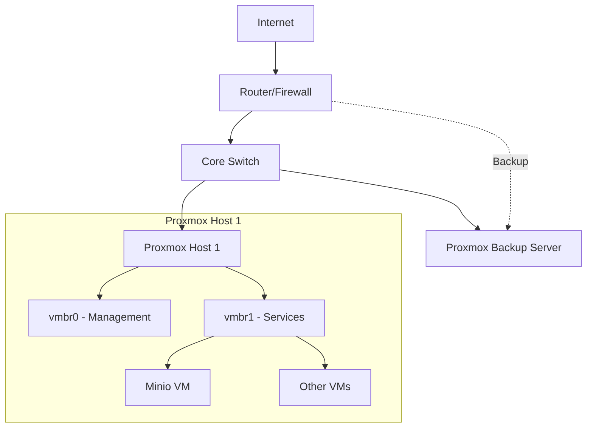

# Network Architecture

## Overview

This document describes the network topology, IP addressing scheme, VLANs, and routing for the homelab infrastructure.

## Network Diagram



## IP Addressing Scheme

### Network Subnets

| Network Name | VLAN ID | Subnet | Gateway | DHCP Range | Purpose |
|--------------|---------|--------|---------|------------|---------|
| Management | - | TBD | TBD | TBD | Proxmox hosts, IPMI |
| Services | - | TBD | TBD | TBD | Internal services |
| DMZ | - | TBD | TBD | TBD | Public-facing services |
| Backup | - | TBD | TBD | None | PBS replication |

### Static IP Allocations

#### Infrastructure

| Hostname | IP Address | MAC Address | Interface | Purpose |
|----------|------------|-------------|-----------|---------|
| router | TBD | TBD | - | Gateway |
| proxmox01 | TBD | TBD | vmbr0 | Proxmox host |
| proxmox01-ipmi | TBD | TBD | - | IPMI/iLO |
| pbs | TBD | TBD | - | Backup server |

#### Services

| Hostname | IP Address | MAC Address | Purpose | Managed By |
|----------|------------|-------------|---------|------------|
| minio | TBD | TBD | Object storage | Manual |

#### DNS Records

| Hostname | Record Type | Value | Purpose |
|----------|-------------|-------|---------|
| proxmox.local | A | TBD | Proxmox web UI |
| minio.local | A | TBD | Minio API |
| minio-console.local | A | TBD | Minio console |
| pbs.local | A | TBD | PBS web UI |

## VLANs

### VLAN Configuration

| VLAN ID | Name | Subnet | Tagged Ports | Untagged Ports |
|---------|------|--------|--------------|----------------|
| 1 | Default | TBD | TBD | TBD |
| 10 | Management | TBD | TBD | TBD |
| 20 | Services | TBD | TBD | TBD |
| 30 | DMZ | TBD | TBD | TBD |

### VLAN Trunk Configuration

**Proxmox Host Trunks:**
```
Interface: TBD
Allowed VLANs: 1,10,20,30
Native VLAN: 1
```

## Proxmox Network Configuration

### Bridges

#### vmbr0 - Management Bridge
```
# /etc/network/interfaces
auto vmbr0
iface vmbr0 inet static
    address TBD
    netmask TBD
    gateway TBD
    bridge-ports eth0
    bridge-stp off
    bridge-fd 0
```

#### vmbr1 - Services Bridge
```
auto vmbr1
iface vmbr1 inet static
    address TBD
    netmask TBD
    bridge-ports eth1
    bridge-stp off
    bridge-fd 0
```

### Network Interfaces

| Interface | Type | Speed | Bridge | Purpose |
|-----------|------|-------|--------|---------|
| eth0 | Physical | 1Gbps | vmbr0 | Management |
| eth1 | Physical | 1Gbps | vmbr1 | Services |

## Firewall Rules

### Proxmox Firewall

**Datacenter Level:**
- Default policy: DROP
- Allow established/related connections
- Log dropped packets

**Key Rules:**

| Direction | Source | Dest | Port | Protocol | Action | Comment |
|-----------|--------|------|------|----------|--------|---------|
| IN | Laptop IP | Any | 8006 | TCP | ACCEPT | Proxmox UI |
| IN | Laptop IP | Any | 22 | TCP | ACCEPT | SSH |
| IN | Management | Any | 9000 | TCP | ACCEPT | Minio API |
| IN | Management | Any | 9001 | TCP | ACCEPT | Minio Console |

### VM-Level Firewall

VMs/containers inherit datacenter rules plus specific overrides:

**Minio VM:**
- Allow 9000/tcp from management network
- Allow 9001/tcp from management network
- Block all other incoming

## DNS Configuration

### Internal DNS

**DNS Server:** TBD
**Domain:** local
**Search Domains:** local

**DNS Forwarders:**
- TBD (e.g., 1.1.1.1, 8.8.8.8)

## Routing

### Default Route

All networks route through: TBD

### Static Routes

| Destination | Gateway | Interface | Purpose |
|-------------|---------|-----------|---------|
| - | - | - | - |

## External Access

### Port Forwarding

| External Port | Internal IP | Internal Port | Protocol | Purpose |
|---------------|-------------|---------------|----------|---------|
| - | - | - | - | - |

### VPN Access

**VPN Type:** TBD (e.g., WireGuard, OpenVPN)
**VPN Server:** TBD
**VPN Subnet:** TBD

## Network Security

### Access Control
- Management network only accessible via VPN
- SSH key-based authentication only
- No root SSH login
- Firewall rules reviewed quarterly

### Monitoring
- Network traffic monitoring: TBD
- Bandwidth monitoring: TBD
- Intrusion detection: TBD

## Troubleshooting

### Common Commands

```bash
# Test connectivity
ping <host>

# Check routing
ip route show

# Check firewall rules
pct exec <ctid> iptables -L -n -v

# Check bridge status
brctl show

# Check VLAN interfaces
ip -d link show
```

### Network Diagrams

For detailed physical cabling and rack layouts, see:
- Physical topology: TBD
- Rack diagram: TBD

## Change Log

| Date | Change | Impact | Author |
|------|--------|--------|--------|
| 2025-11-03 | Initial network documentation | None | - |

## Future Plans

- [ ] Implement VLANs for network segmentation
- [ ] Deploy pfSense/OPNsense for advanced routing
- [ ] Set up monitoring (LibreNMS/Observium)
- [ ] Document physical cabling
- [ ] Add network diagrams with actual topology
