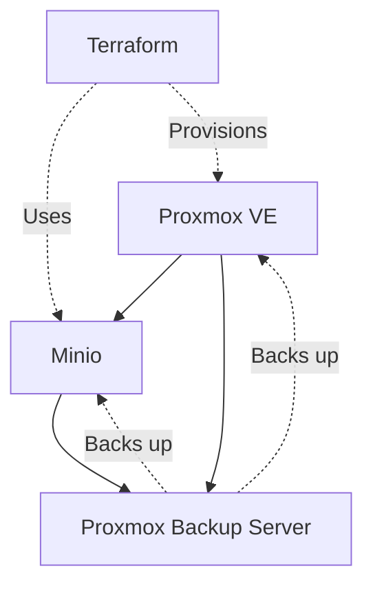

# Services Documentation

## Overview

This document catalogs all services running in the homelab, their purpose, configuration, and access details.

## Service Catalog

### Infrastructure Services

#### Proxmox VE
- **Purpose:** Virtualization platform
- **Type:** Bare metal
- **Version:** TBD
- **Access:** https://proxmox.local:8006
- **Auth:** API token (stored in SOPS)
- **Backup:** Configuration backed up via PBS
- **Monitoring:** Built-in
- **Documentation:** [Proxmox VE Docs](https://pve.proxmox.com/wiki/Main_Page)

#### Minio
- **Purpose:** S3-compatible object storage for Terraform state
- **Type:** VM/LXC
- **Version:** TBD
- **Access:**
  - API: http://minio.local:9000
  - Console: http://minio.local:9001
- **Auth:** Access key/secret (stored in SOPS)
- **Backup:** VM backed up via PBS
- **Encryption:** Server-side encryption (sse-s3) enabled
- **Versioning:** Enabled on all buckets
- **Monitoring:** TBD
- **Documentation:** [Minio Docs](https://min.io/docs/minio/linux/index.html)

#### Proxmox Backup Server (PBS)
- **Purpose:** Backup solution
- **Type:** VM/Physical
- **Version:** TBD
- **Access:** https://pbs.local:8007
- **Auth:** TBD
- **Backup Targets:**
  - Local: TBD
  - Remote: TBD
- **Retention:**
  - Daily: 7 days
  - Weekly: 4 weeks
  - Monthly: 6 months
- **Documentation:** [PBS Docs](https://pbs.proxmox.com/docs/)

### Application Services

| Service | Purpose | Host | Port | Protocol | Status |
|---------|---------|------|------|----------|--------|
| - | - | - | - | - | - |

## Service Dependencies



## Service Access Matrix

### Authentication Methods

| Service | Auth Method | Credentials Location | 2FA Enabled |
|---------|-------------|---------------------|-------------|
| Proxmox VE | API Token | terraform.tfvars.enc | N/A |
| Minio | Access Key/Secret | terraform.tfvars.enc | No |
| PBS | Username/Password | Password Manager | TBD |
| GitHub | Username/Password | Password Manager | Yes (Yubikey) |

### Network Access

| Service | Internal Access | External Access | VPN Required |
|---------|----------------|-----------------|--------------|
| Proxmox VE | Yes | No | Yes |
| Minio | Yes | No | Yes |
| PBS | Yes | No | Yes |

## Service Configuration

### Minio Configuration

**Buckets:**
| Bucket Name | Purpose | Encryption | Versioning | Lifecycle Policy |
|-------------|---------|------------|------------|------------------|
| terraform-state | Terraform state storage | SSE-S3 | Enabled | None |

**Users:**
| Username | Access Level | Purpose |
|----------|-------------|---------|
| admin | Full | Administration |
| terraform-user | Read/Write terraform-state | Terraform automation |

**Service File:** `/etc/systemd/system/minio.service`
**Config File:** `/etc/default/minio`
**Data Directory:** `/data/minio`

### Proxmox Configuration

**Cluster:** TBD (standalone or clustered)
**HA:** TBD
**Storage Pools:** See [infrastructure.md](infrastructure.md)

## Monitoring & Alerting

### Service Health Checks

| Service | Check Method | Frequency | Alert On |
|---------|-------------|-----------|----------|
| Proxmox | Web UI ping | 5 min | Down |
| Minio | API healthcheck | 5 min | Down |
| PBS | Web UI ping | 5 min | Down |

### Metrics Collection

**Current State:** TBD

**Planned:**
- Prometheus for metrics collection
- Grafana for visualization
- Node exporter on all hosts

## Backup & Recovery

### Backup Schedule

| Service | Backup Method | Frequency | Retention | Last Verified |
|---------|--------------|-----------|-----------|---------------|
| Proxmox Config | PBS | Daily | 30 days | TBD |
| Minio VM | PBS | Daily | 30 days | TBD |
| Minio Data | PBS + Versioning | Continuous | 30 days | TBD |

### Recovery Procedures

See [runbooks/backup-restore.md](runbooks/backup-restore.md) for detailed procedures.

## Service Maintenance

### Update Schedule

| Service | Update Method | Schedule | Last Updated |
|---------|--------------|----------|--------------|
| Proxmox VE | apt upgrade | Monthly | TBD |
| Minio | Manual binary update | Quarterly | TBD |
| PBS | apt upgrade | Monthly | TBD |

### Maintenance Windows

**Preferred Window:** Sunday 02:00-06:00 local time

### Pre-Update Checklist

- [ ] Take full backup via PBS
- [ ] Verify backup integrity
- [ ] Notify users (if applicable)
- [ ] Review changelog
- [ ] Test in development first (if applicable)

## Service URLs

### Quick Access

```bash
# Proxmox VE
https://proxmox.local:8006

# Minio Console
http://minio.local:9001

# Proxmox Backup Server
https://pbs.local:8007

# GitHub Repository
https://github.com/YOUR_USERNAME/proxmox-terraform
```

## Secrets Management

### Secrets Inventory

| Secret | Service | Storage Location | Rotation Schedule |
|--------|---------|------------------|-------------------|
| Proxmox API Token | Proxmox VE | terraform.tfvars.enc | Yearly |
| Minio Root Password | Minio | /etc/default/minio + PBS backup | Yearly |
| Minio Access Key | Minio | terraform.tfvars.enc | Yearly |
| PBS Credentials | PBS | Password Manager | Yearly |

### Secret Rotation Procedure

1. Generate new secret
2. Update service configuration
3. Update terraform.tfvars
4. Re-encrypt with SOPS
5. Test access
6. Document rotation date
7. Revoke old secret

## Service Documentation Links

### External Resources

- [Terraform Telmate Proxmox Provider](https://registry.terraform.io/providers/Telmate/proxmox/latest/docs)
- [Minio Terraform Backend](https://developer.hashicorp.com/terraform/language/settings/backends/s3)
- [SOPS Documentation](https://github.com/getsops/sops)

### Internal Documentation

- [Security Setup](../proxmox-terraform/SECURITY_SETUP.md)
- [Infrastructure Inventory](infrastructure.md)
- [Network Architecture](network.md)
- [Backup & Restore Runbook](runbooks/backup-restore.md)

## Troubleshooting

### Common Issues

**Minio not accessible:**
```bash
# Check service status
systemctl status minio

# Check logs
journalctl -u minio -f

# Verify listening ports
ss -tlnp | grep minio
```

**Proxmox API timeout:**
```bash
# Check network connectivity
ping proxmox.local

# Check API status
curl -k https://proxmox.local:8006/api2/json/version
```

**Terraform state locked:**
```bash
# Check Minio access
mc ls myminio/terraform-state

# Force unlock (use with caution)
terraform force-unlock LOCK_ID
```

## Future Services

Planned services to deploy:

- [ ] **NetBox** - Infrastructure documentation and IPAM
- [ ] **Prometheus** - Metrics collection
- [ ] **Grafana** - Metrics visualization
- [ ] **Uptime Kuma** - Service monitoring
- [ ] **Authentik** - SSO/Identity provider
- [ ] **Traefik** - Reverse proxy with automatic SSL
- [ ] **GitLab/Gitea** - Self-hosted git (if needed)

## Change Log

| Date | Service | Change | Author |
|------|---------|--------|--------|
| 2025-11-03 | Minio | Initial deployment planned | - |
